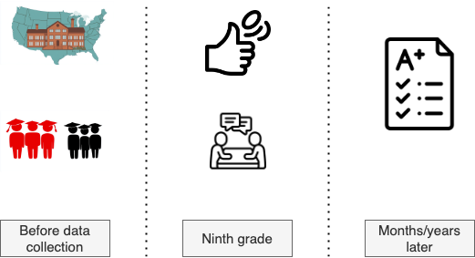

<!-- _color: "black" -->
<!-- _footer: ''-->
<!-- _header: ''-->

<!-- _paginate: skip -->

# Learning From Experiments With Causal Machine Learning

## A case study using `metalearners`

Francesc Martí Escofet (@fmartiescofet)
Kevin Klein (@kevkle)

---

<!-- _footer: ''-->
<!-- _header: ''-->

<!-- _paginate: skip -->

<!-- According to the National Study, “A growth mindset is the belief that intelligence can be developed. Students with
a growth mindset understand they can get smarter through hard work, the use of effective strategies, and help from
others when needed. It is contrasted with a fixed mindset: the belief that intelligence is a fixed trait that is set in stone
at birth.” -->

---

# Which students profit the most from a growth mindset coaching?

---

## National Study of Learning Mindsets

---

## The data, more formally

Every datapoint $i$ corresponds to a student.

| Name                  | Symbol | Definition                                                                                           |
| --------------------- | ------ | ---------------------------------------------------------------------------------------------------- |
| Covariates            | $X_i$  | Properties of the student or the student's school                                                    |
| Treatment assignments | $W_i$  | $\begin{cases} 1 & \text{if received coaching} \\ 0 & \text{if didn't receive coaching} \end{cases}$ |
| Outcome               | $Y_i$  | GPA ($\in \mathbb{R}$) after intervention                                                            |

$\mathcal{D} = \{ (X_i, W_i, Y_i)\}$

---

## The data, an excerpt

|  $i$ | schoolid | intervention | achievement_score | success_expect | ethnicity | gender | frst_in_family | school_urbanicity | school_mindset | school_achievement | school_ethnic_minority | school_poverty | school_size |
| ---: | -------: | -----------: | ----------------: | -------------: | --------: | -----: | -------------: | ----------------: | -------------: | -----------------: | ---------------------: | -------------: | ----------: |
| 6136 |       53 |            0 |          -2.37507 |              4 |         4 |      2 |              1 |                 3 |       0.999101 |           0.440912 |               -1.34477 |      -0.304868 |     -1.6462 |
| 9033 |       15 |            0 |           1.70741 |              7 |         4 |      1 |              1 |                 2 |    -0.00995388 |           0.762804 |              -0.225752 |      0.0826126 |    0.350672 |
| 5887 |       57 |            0 |       -0.00345358 |              5 |         4 |      1 |              0 |                 2 |      0.0971624 |          -0.292353 |               -1.03087 |      -0.813799 |    0.184716 |
| 1975 |       29 |            1 |          -0.26435 |              3 |        12 |      2 |              1 |                 1 |      -0.373087 |           0.113096 |              -0.833417 |       -1.92478 |    -1.14731 |
| 9445 |        8 |            0 |         -0.696919 |              5 |         1 |      2 |              1 |                 2 |       0.120413 |           0.105801 |                1.66055 |       0.226545 |     1.00131 |

---

## The data, the details

- n = 10,392
  - ~1/3 received coaching
- Originally from National Study of Learning Mindsets
  - Nature, September 2019
- We used an anonymized version from [Athey and Wager](https://arxiv.org/pdf/1902.07409)
  - Further processing by Matheus Facure

---

<!-- _footer: ''-->
<!-- _header: ''-->

## Please leave feedback on GitHub! :)

[github.com/QuantCo/metalearners](https://github.com/QuantCo/metalearners)

[github.com/kklein/pdp24-metalearners](https://github.com/kklein/pdp24-metalearners)

---

<!-- _footer: ''-->
<!-- _header: ''-->

## Would you like to work on such topics, too?

Join us!
[quantco.com](https://www.quantco.com)

---

<!-- _footer: ''-->
<!-- _header: ''-->

---

# Backup

---

## Data dictionary

| Name                   | Type        | Meaning                                                                                        |
| ---------------------- | ----------- | ---------------------------------------------------------------------------------------------- |
| ethnicity              | categorical | student race/ethnicity                                                                         |
| gender                 | categorical | student-identified gender                                                                      |
| success_expect         | discrete    | self-reported expectations for success in the future                                           |
| frst_in_family         | boolean     | ?? first in family to go to college ??                                                         |
| schoolid               | categorical | identifier for each of 76 high schools                                                         |
| school_urbanicity      | categorical | school's urbanicity (urban, rural, etc.)                                                       |
| school_mindset         | numerical   | school's mean mindset                                                                          |
| school_achievement     | numerical   | average test scores and college preparation for the previous 4 cohorts of students             |
| school_ethnic_minority | numerical   | percentage of student body that is Black, Latino, or Native American                           |
| school_povetry         | numerical   | percentage of students who are from families whose incomes fall below the federal poverty line |
| school_size            | numerical   | total number of students in all four grade levels in the school                                |

---

## Conventional assumptions for estimating CATEs

- Positivity/overlap
- Conditional ignorability/unconfoundedness
- Stable Unit Treatment Value (SUTVA)

A randomized control trial usually gives us the first two for free.

For more information see e.g. [Athey and Imbens, 2016](https://arxiv.org/pdf/1607.00698.pdf).

---

## Python implementations of MetaLearners

|                                           | `metalearners` | `causalml` | `econml` |
| ----------------------------------------- | :------------: | :--------: | :------: |
| MetaLearner implementations               |       ✔️       |     ✔️     |    ✔️    |
| Support\* for `pandas`, `scipy`, `polars` |       ✔️       |     ❌     |    ❌    |
| HPO integration                           |       ✔️       |     ❌     |    ❌    |
| Concurrency across base models            |       ✔️       |     ❌     |    ❌    |
| >2 treatment variants                     |       ✔️       |     ✔️     |    ❌    |
| Classification\*                          |       ✔️       |     ❌     |    ✔️    |
| Other Causal Inference methods            |       ❌       |     ✔️     |    ✔️    |
