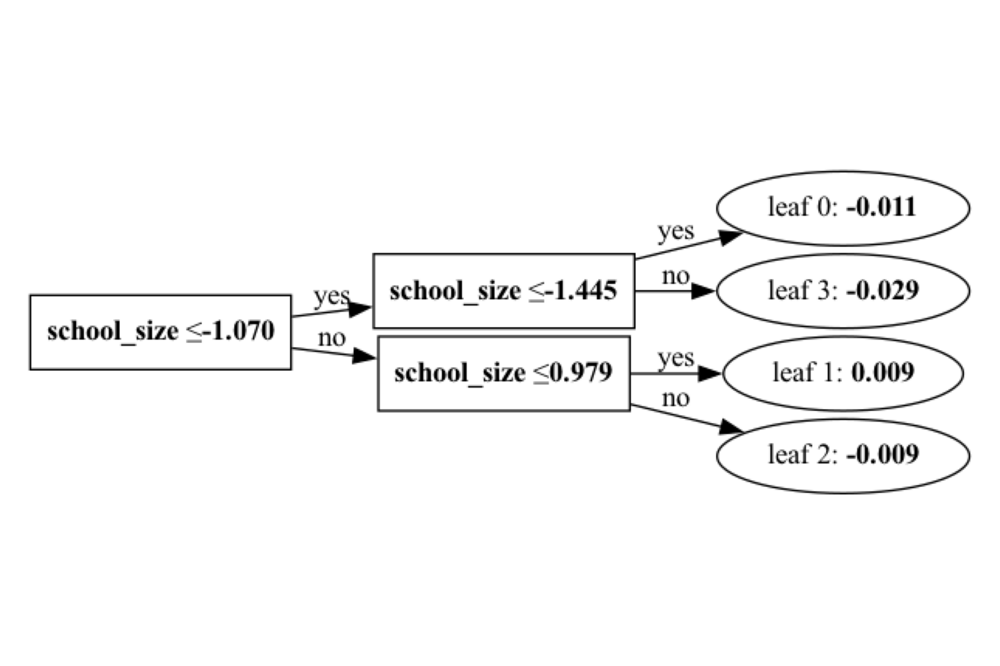
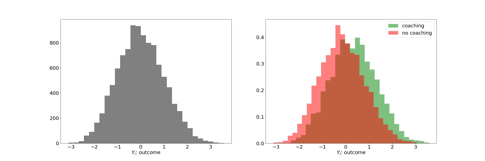
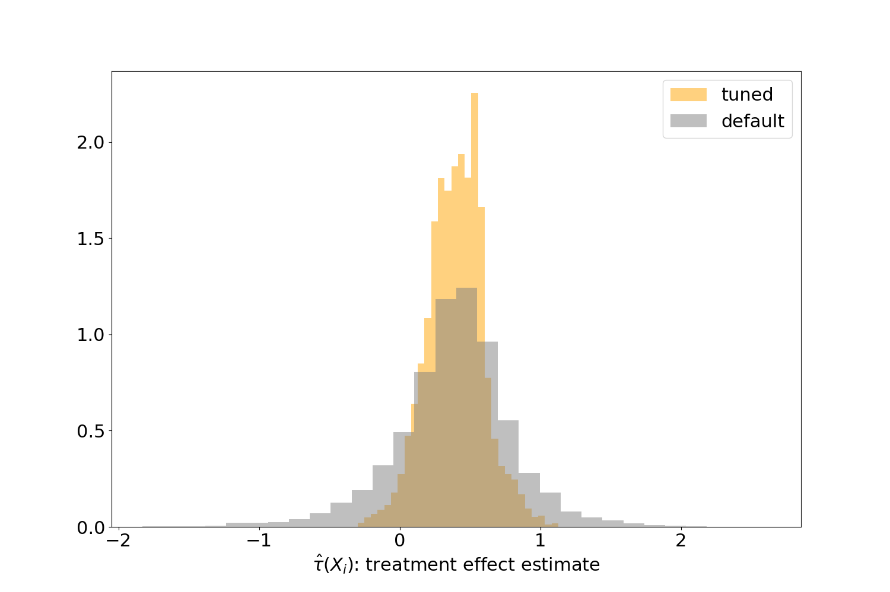
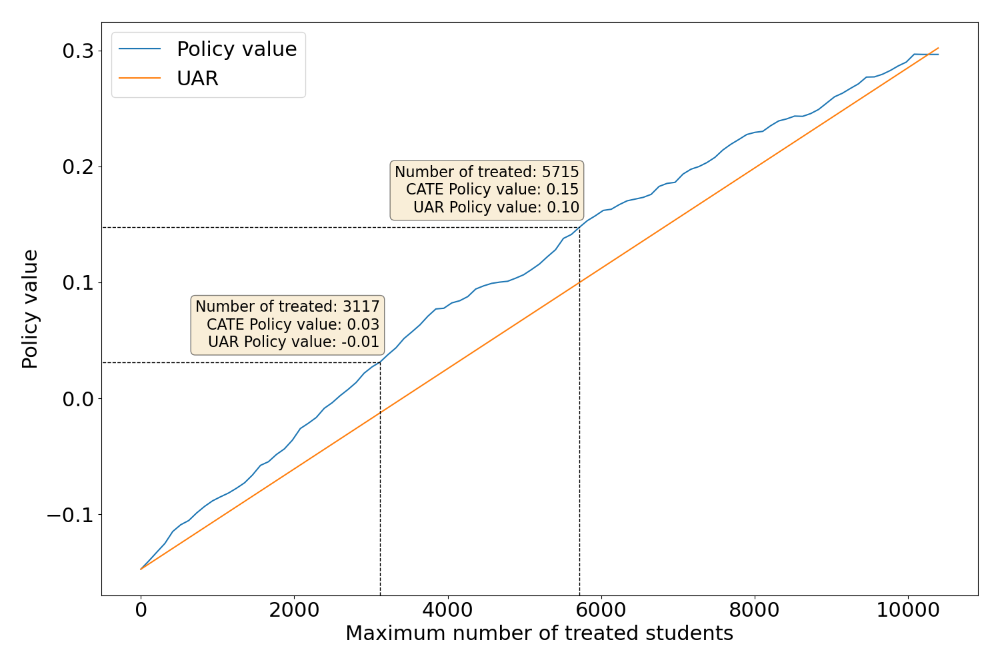
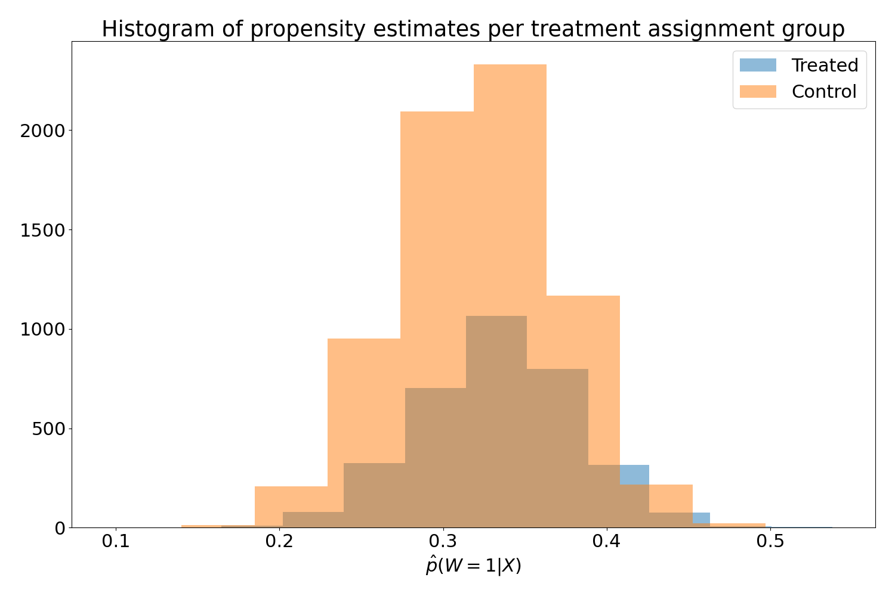

<style>
img[alt~="center"] {
  display: block;
  margin: 0 auto;
}
</style>

<!-- _color: "black" -->
<!-- _footer: ''-->
<!-- _header: ''-->

<!-- _paginate: skip -->

# Learning From Experiments With Causal Machine Learning

## A case study using `metalearners`

Francesc Martí Escofet (@fmartiescofet)
Kevin Klein (@kevkle)

---

<!-- _footer: ''-->
<!-- _header: ''-->

<!-- _paginate: skip -->


<!-- According to the National Study, “A growth mindset is the belief that intelligence can be developed. Students with
a growth mindset understand they can get smarter through hard work, the use of effective strategies, and help from
others when needed. It is contrasted with a fixed mindset: the belief that intelligence is a fixed trait that is set in stone
at birth.” -->

---

# We live in a budget-constrained world.

# Which students profit the most from a growth mindset coaching?

---

<!-- _paginate: skip -->

## National Study of Learning Mindsets


---

<!-- _paginate: skip -->

## National Study of Learning Mindsets


---

## National Study of Learning Mindsets


---

## The data, more formally

Every datapoint $i$ corresponds to a student.

| Name                  | Symbol | Definition                                                                                           |
| --------------------- | ------ | ---------------------------------------------------------------------------------------------------- |
| Covariates            | $X_i$  | Properties of the student or the student's school                                                    |
| Treatment assignments | $W_i$  | $\begin{cases} 1 & \text{if received coaching} \\ 0 & \text{if didn't receive coaching} \end{cases}$ |
| Outcome               | $Y_i$  | GPA ($\in \mathbb{R}$) after intervention                                                            |

$\mathcal{D} = \{ (X_i, W_i, Y_i)\}$

---

## The data, the details

<!-- prettier-ignore -->
* n = 10,391
  * ~1/3 received coaching
* Originally from National Study of Learning Mindsets
  * Nature, September 2019
* We used an anonymized version from [Athey and Wager](https://arxiv.org/pdf/1902.07409)
  * All continuous features have been transformed to a standard Normal

---

## The data, an excerpt

|      | schoolid | success_expect | ethnicity | gender | frst_in_family | school_urbanicity | school_mindset | school_achievement | school_ethnic_minority | school_poverty | school_size | intervention | achievement_score |
| ---: | -------: | -------------: | --------: | -----: | -------------: | ----------------: | -------------: | -----------------: | ---------------------: | -------------: | ----------: | -----------: | ----------------: |
| 3625 |       75 |              5 |         2 |      1 |              1 |                 3 |       0.991628 |          -0.674142 |                1.56432 |       0.230755 |    -1.51191 |            0 |          -1.30763 |
| 3037 |        5 |              2 |         2 |      1 |              1 |                 0 |     -0.0551495 |          -0.544506 |                1.30259 |       -1.73516 |   -0.792146 |            1 |         -0.537256 |
| 2574 |       17 |              7 |         4 |      2 |              1 |                 4 |        1.57064 |            -1.0215 |               0.361202 |          1.044 |   -0.470404 |            1 |           0.86336 |
| 1488 |       47 |              6 |         5 |      2 |              1 |                 4 |       -1.23927 |           0.599242 |             0.00542947 |        1.26768 |     0.95851 |            1 |           1.80572 |
| 3677 |       74 |              6 |        11 |      2 |              1 |                 4 |       0.983982 |          -0.449943 |              0.0881594 |      -0.657131 |   -0.323959 |            0 |           0.56474 |

---

## Loading the data

```python
import pandas as pd

df = pd.read_csv("learning_mindset.csv")
```

<div data-marpit-fragment>

```python
categorical_feature_columns = [
    "ethnicity",
    "gender",
    "frst_in_family",
    "school_urbanicity",
    "schoolid",
]
```

</div>

<div data-marpit-fragment>

```python
for column in categorical_feature_columns:
    df[column] = df[column].astype("category")
```

</div>

---

## Why categoricals?



---

## Outcomes

```python
ax.hist(df[treatment_column])
```

```python
ax.hist(df[W=1][outcome_column], density=True)
ax.hist(df[W=0][outcome_column], density=True)
```



---

## What do we do with the data now?

<!-- prettier-ignore -->
* Remember, our original question was

  > Which students profit the most from a growth mindset coaching?

* We'll reduce said question to the following question

  > How much would a student like student $i$ profit from a growth mindset coaching?

* The latter we can formalize with notation and terminology from
  Causal Inference: **Conditional Average Treatment Effect** (CATE)

  $$\tau(X_i) = \mathbb{E}[Y(\text{coaching}) - Y(\text{no coaching}) | X=X_i]$$

---

## MetaLearners


<!-- prettier-ignore -->
* Input
  - $W$: Treatment assignments
  - $X$: Covariates/features
  - $Y$: Outcomes
* Output
  - $\hat{\tau}(X)$: CATE estimates

---

## Creating a first MetaLearner

<div data-marpit-fragment>

```python
from metalearners import RLearner
from lightgbm import LGBMRegressor, LGBMClassifier
```

</div>
<div data-marpit-fragment>

<marp-pre is="marp-pre" data-auto-scaling="downscale-only"><code class="language-python">rlearner = RLearner(
<span style="color:orange">&nbsp;&nbsp;&nbsp;&nbsp;nuisance_model_factory=LGBMRegressor,
&nbsp;&nbsp;&nbsp;&nbsp;propensity_model_factory=LGBMClassifier,
&nbsp;&nbsp;&nbsp;&nbsp;treatment_model_factory=LGBMRegressor,</span>
&nbsp;&nbsp;&nbsp;&nbsp;is_classification=<span class="hljs-literal">False</span>,
&nbsp;&nbsp;&nbsp;&nbsp;n_variants=<span class="hljs-number">2</span>,
)
</code></marp-pre>

</div>
<div style="visibility: hidden">

```python
rlearner.fit(
    X=df[feature_columns], y=df[outcome_column], w=df[treatment_column]
)
```

</div>

---

## Creating a first MetaLearner

<div>

```python
from metalearners import RLearner
from lightgbm import LGBMRegressor, LGBMClassifier
```

</div>
<div>

<marp-pre is="marp-pre" data-auto-scaling="downscale-only"><code class="language-python">rlearner = RLearner(
&nbsp;&nbsp;&nbsp;&nbsp;nuisance_model_factory=LGBMRegressor,
&nbsp;&nbsp;&nbsp;&nbsp;propensity_model_factory=LGBMClassifier,
&nbsp;&nbsp;&nbsp;&nbsp;treatment_model_factory=LGBMRegressor,
<span style="color:orange">&nbsp;&nbsp;&nbsp;&nbsp;is_classification=<span class="hljs-literal">False</span>,
&nbsp;&nbsp;&nbsp;&nbsp;n_variants=<span class="hljs-number">2</span>,</span>
)
</code></marp-pre>

</div>
<div data-marpit-fragment>

```python
rlearner.fit(
    X=df[feature_columns], y=df[outcome_column], w=df[treatment_column]
)
```

</div>

---

## Predicting with a MetaLearner

```python
rlearner.predict(df[feature_columns], is_oos=False)
```


---

<!-- _footer: ''-->
<!-- _header: ''-->
<!-- _paginate: skip -->


---

## Hyperparameter optimization

<!-- prettier-ignore -->
* HPO can have massive impacts on the prediction quality in regular Machine Learning
* According to [Machlanski et. al (2023)](https://arxiv.org/abs/2303.01412) this also happens in MetaLearners
* Three levels to optimize for:
  * The MetaLearner architecture
  * The model to choose per base estimator
  * The model hyperparameters per base model

---

<!-- _paginate: skip -->

## Performing a grid search


---

<!-- _paginate: skip -->

## Performing a grid search


---

<!-- _paginate: skip -->

## Performing a grid search


---

<!-- _paginate: skip -->

## Performing a grid search


---

## Performing a grid search


---

## Performing a grid search

```python
gs = MetaLearnerGridSearch(
    metalearner_factory=RLearner,
    metalearner_params={"is_classification": False, "n_variants": 2},
    base_learner_grid={
        "outcome_model": [LGBMRegressor],
        "propensity_model": [LGBMClassifier],
        "treatment_model": [LGBMRegressor],
    },
    param_grid={
        "outcome_model": {
            "LGBMRegressor": {"n_estimators": [25, 50, 100], "max_depth": [-1, 5]}
        },
        "treatment_model": {
            "LGBMRegressor": {"n_estimators": [5, 20, 50], "max_depth": [-1, 3, 5]}
        },
        "propensity_model": {
            "LGBMClassifier": {"n_estimators": [5, 50], "max_depth": [-1, 3, 5]}
        },
    },
)
gs.fit(X_train, y_train, w_train, X_validation, y_validation, w_validation)
```

---

| hyperparameters       | time fit | time score | train propensity | train outcome | train r_loss | train treatment | test propensity | test outcome_model | test r_loss | test treatment |
| :-------------------- | -------: | ---------: | ---------------: | ------------: | -----------: | --------------: | --------------: | -----------------: | ----------: | -------------: |
| -1, 25, -1, 5, -1, 5  | 0.899935 |   0.304743 |        -0.631725 |     -0.817461 |     0.795676 |        -1.69679 |       -0.632262 |          -0.838749 |    0.813108 |       -1.73267 |
| -1, 25, -1, 5, -1, 20 | 0.965532 |   0.312325 |        -0.631725 |     -0.817461 |     0.798854 |        -1.70357 |       -0.632262 |          -0.838749 |    0.815334 |       -1.73741 |
| -1, 25, -1, 5, -1, 50 |  1.19587 |   0.365287 |        -0.631725 |     -0.817461 |     0.804784 |        -1.71622 |       -0.632262 |          -0.838749 |    0.820561 |       -1.74855 |
| -1, 25, -1, 5, 3, 5   | 0.890464 |   0.299951 |        -0.631725 |     -0.817461 |     0.795109 |        -1.69558 |       -0.632262 |          -0.838749 |     0.81244 |       -1.73125 |
| ...                   |      ... |        ... |              ... |           ... |          ... |             ... |             ... |                ... |         ... |            ... |
| 5, 100, 5, 50, 5, 50  |  1.88036 |   0.488988 |        -0.647935 |     -0.829237 |     0.813944 |        -1.71139 |       -0.646439 |          -0.846896 |    0.827979 |       -1.74124 |

---

## Predicting with a **tuned** MetaLearner

```python
tuned_rlearner.predict(df[feature_columns], is_oos=False)
```



---

<!-- _footer: ''-->
<!-- _header: ''-->

<!-- _paginate: skip -->


---

## SHAP values

```python
from shap import TreeExplainer, summary_plot
explainer = learner.explainer()
shap_values = explainer.shap_values(df[feature_columns], TreeExplainer)
summary_plot(shap_values[0], features=df[feature_columns])
```


---

## But now, how are we actually doing?

We can define the policy value as:
$$ V(\pi) = \mathbb{E}[Y_i(\pi (X_i))]$$

Using our CATE estimates, we can define a policy that targets the most promising students, specifically, those with the highest CATE estimates.

---

## But now, how are we actually doing?



---

<!-- _footer: ''-->
<!-- _header: ''-->


## Please leave feedback on GitHub! :)

[github.com/QuantCo/metalearners](https://github.com/QuantCo/metalearners)

[github.com/kklein/pdp24-metalearners](https://github.com/kklein/pdp24-metalearners)

---

<!-- _footer: ''-->
<!-- _header: ''-->

## Would you like to work on such topics, too?

Join us!
[quantco.com](https://www.quantco.com)


---

<!-- _footer: ''-->
<!-- _header: ''-->


---

# Backup

---

## Data dictionary

| Name                   | Type        | Meaning                                                                                        |
| ---------------------- | ----------- | ---------------------------------------------------------------------------------------------- |
| ethnicity              | categorical | student race/ethnicity                                                                         |
| gender                 | categorical | student-identified gender                                                                      |
| success_expect         | discrete    | self-reported expectations for success in the future                                           |
| frst_in_family         | boolean     | ?? first in family to go to college ??                                                         |
| schoolid               | categorical | identifier for each of 76 high schools                                                         |
| school_urbanicity      | categorical | school's urbanicity (urban, rural, etc.)                                                       |
| school_mindset         | numerical   | school's mean mindset                                                                          |
| school_achievement     | numerical   | average test scores and college preparation for the previous 4 cohorts of students             |
| school_ethnic_minority | numerical   | percentage of student body that is Black, Latino, or Native American                           |
| school_poverty         | numerical   | percentage of students who are from families whose incomes fall below the federal poverty line |
| school_size            | numerical   | total number of students in all four grade levels in the school                                |

---

## Conventional assumptions for estimating CATEs

- Positivity/overlap
- Conditional ignorability/unconfoundedness
- Stable Unit Treatment Value (SUTVA)

A randomized control trial usually gives us the first two for free.

For more information see e.g. [Athey and Imbens,
2016](https://arxiv.org/pdf/1607.00698.pdf).

---



---

## Policy value estimation

We estimated policy values via the 'Inverse-Propensity Weighting' estimator:
$$ \hat{V}_{IPW}(\pi) = \frac{1}{n} \sum_{i=1}^n \frac{Y_i \mathbb{I}[W_i = \pi(X_i)]}{\Pr[W_i = \pi(X_i) | X_i]} $$

For more details, please see [Stefan Wager's lecture notes](https://web.stanford.edu/~swager/stats361.pdf).

---

## Python implementations of MetaLearners

|                                           | `metalearners` | `causalml` | `econml` |
| ----------------------------------------- | :------------: | :--------: | :------: |
| MetaLearner implementations               |       ✔️       |     ✔️     |    ✔️    |
| Support\* for `pandas`, `scipy`, `polars` |       ✔️       |     ❌     |    ❌    |
| HPO integration                           |       ✔️       |     ❌     |    ❌    |
| Concurrency across base models            |       ✔️       |     ❌     |    ❌    |
| >2 treatment variants                     |       ✔️       |     ✔️     |    ❌    |
| Classification\*                          |       ✔️       |     ❌     |    ✔️    |
| Other Causal Inference methods            |       ❌       |     ✔️     |    ✔️    |
